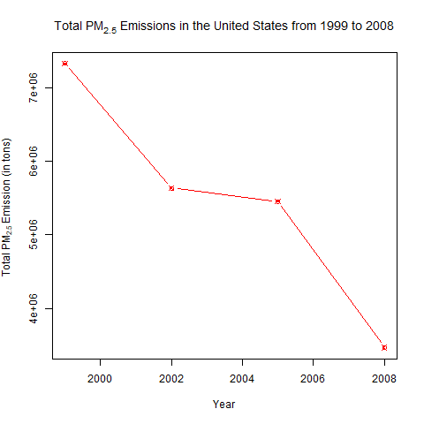
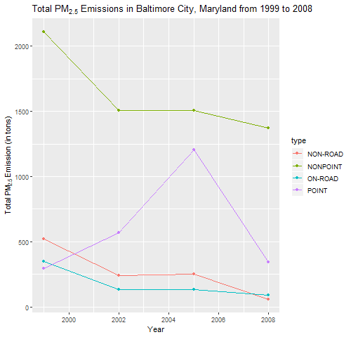
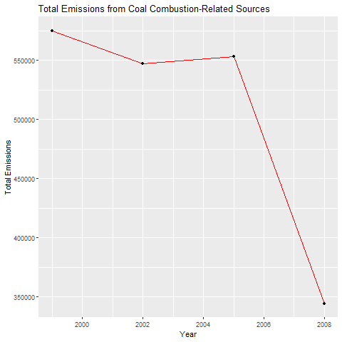
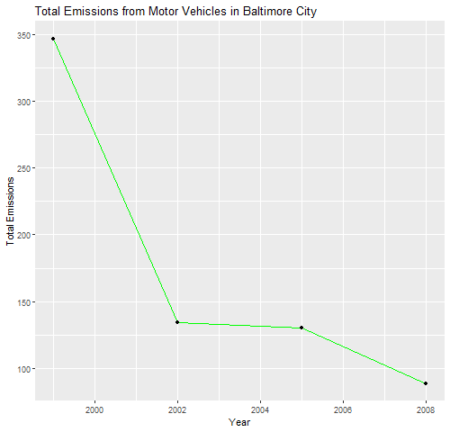
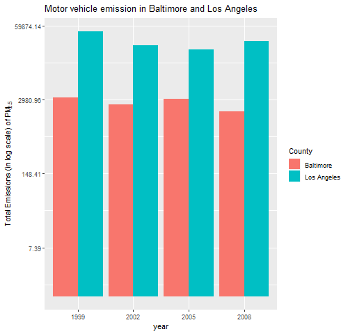

# Explore the National Emissions Inventory database

Introduction

Fine particulate matter (PM2.5) is an ambient air pollutant for which there is strong evidence that it is harmful to human health. In the United States, the Environmental Protection Agency (EPA) is tasked with setting national ambient air quality standards for fine PM and for tracking the emissions of this pollutant into the atmosphere. Approximatly every 3 years, the EPA releases its database on emissions of PM2.5. This database is known as the National Emissions Inventory (NEI). 

For each year and for each type of PM source, the NEI records how many tons of PM2.5 were emitted from that source over the course of the entire year. The data that we will use for this assignment are for 1999, 2002, 2005, and 2008.

The overall goal of this assignment is to explore the National Emissions Inventory database and see what it say about fine particulate matter pollution in the United states over the 10-year period 1999–2008. 

The four plots that you will need to construct are shown below. 

### Plot 1

 

### Plot 2

 

### Plot 3

 

### Plot 4

 

### Plot 5

 

### Plot 6

 

